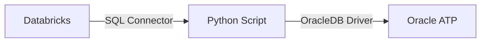
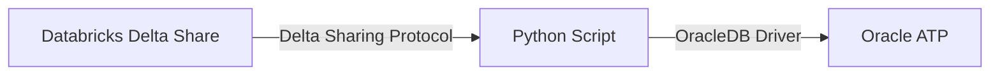

# Databricks to Oracle ATP Data Migration Tool

Migrate data from Databricks to Oracle Autonomous Transaction Processing (ATP) with support for both direct connection and Delta Sharing.

## Data Flow

### Method 1: Direct Connection


### Method 2: Delta Sharing


## Quick Start

```bash
# 1. Clone and navigate to project
cd dbrx-to-oci-atp

# 2. Create virtual environment
python3 -m venv .venv
source .venv/bin/activate

# 3. Install dependencies
pip install -r requirements.txt

# 4. Configure environment
cp .env.example .env
# Edit .env with your credentials

# 5. Run the script
python src/dbrx-data.py
```

## Configuration

### 1. Oracle ATP Setup

Download your ATP wallet from Oracle Cloud Console:
- Navigate to your ATP database → **DB Connection** → **Download Wallet**
- Extract to project directory (e.g., `./Wallet_myatp`)

### 2. Environment Variables

Update `.env` with your credentials:

```bash
# For Direct Databricks Connection
DATABRICKS_SERVER_HOSTNAME=your-workspace.cloud.databricks.com
DATABRICKS_HTTP_PATH=/sql/1.0/warehouses/your-warehouse-id
DATABRICKS_ACCESS_TOKEN=your-access-token

# For Delta Sharing (alternative to direct connection)
DELTA_SHARE_PROFILE_PATH=./config.share
DELTA_SHARE_NAME=your_share_name
DELTA_SCHEMA_NAME=your_schema_name
DELTA_TABLE_NAME=your_table_name

# Oracle ATP Configuration
ORACLE_USER=ADMIN
ORACLE_PASSWORD=your-password
ORACLE_DSN=your_tns_name_high
ORACLE_WALLET_LOCATION=./Wallet_myatp
ORACLE_WALLET_PASSWORD=
```

## Usage

### Method 1: Direct Databricks Connection

Edit `src/dbrx-data.py` and uncomment:

```python
# Create table and insert data in Databricks
create_table()
insert_synthetic_data(num_rows=1000, start_id=1)

# Create table in Oracle ATP
create_oracle_table(oracle_user, oracle_password, oracle_dsn,
                   oracle_wallet_location, oracle_wallet_password)

# Migrate from Databricks to Oracle ATP
migrate_to_oracle(oracle_user, oracle_password, oracle_dsn,
                 oracle_wallet_location, oracle_wallet_password)
```

### Method 2: Delta Sharing (No Databricks Credentials Required)

Edit `src/dbrx-data.py` and uncomment:

```python
# Create table in Oracle ATP
create_oracle_table(oracle_user, oracle_password, oracle_dsn,
                   oracle_wallet_location, oracle_wallet_password)

# Migrate from Delta Share to Oracle ATP
migrate_to_oracle_delta_share(
    delta_profile_path, delta_share_name, delta_schema_name, delta_table_name,
    oracle_user, oracle_password, oracle_dsn,
    oracle_wallet_location, oracle_wallet_password
)
```

### Run the Script

```bash
python src/dbrx-data.py
```

## Demo: Public Delta Share

Test the migration with a public dataset (no Databricks credentials needed):

```python
# Uses included demo.share for Boston Housing dataset
python src/dbrx-data.py  # Already configured in script
```

This migrates 200 rows from the public Boston Housing dataset to your Oracle ATP instance.

## Project Structure

```
dbrx-to-oci-atp/
├── src/
│   ├── dbrx-data.py                 # Main migration script
│   ├── test_delta_sharing.py        # Delta sharing tests
│   └── test_delta_sharing_simple.py # Simple examples
├── demo.share                        # Public demo config
├── requirements.txt                  # Python dependencies
├── .env.example                      # Environment template
└── README.md                         # This file
```

## Troubleshooting

| Error | Solution |
|-------|----------|
| `DPY-4027: no configuration directory` | Verify wallet location path is correct |
| `DPY-6000: Listener refused connection` | Check TNS name matches `tnsnames.ora` |
| `ORA-12506` | Ensure correct TNS name for TCPS connections |
| Import errors | Run `pip install -r requirements.txt` |

## Oracle Integration Cloud (OIC) Usage

### Method 3: OCI Function via OIC

The migration can be orchestrated through Oracle Integration Cloud by invoking the deployed OCI Function.

#### 1. OIC REST Connection Setup

**Connection Configuration:**
- Connection Type: REST API Base URL
- Connection URL: `https://<your-function-region>.functions.oci.oraclecloud.com`
- Security Policy: OCI Signature Version 1

#### 2. Configure REST Trigger in OIC

**Endpoint Configuration:**
- Method: POST
- URI: `/20181201/functions/<your-function-ocid>/actions/invoke`
- Content-Type: `application/json`

**Required Headers:**
- `Content-Type: application/json`
- `fn-intent: httprequest`
- `fn-invoke-type: sync`

#### 3. Request Payload

```json
{
  "delta_profile_base64": "base64_encoded_delta_share_profile_content",
  "share_name": "delta_sharing",
  "schema_name": "default",
  "table_name": "boston-housing",
  "oracle_user": "ADMIN",
  "oracle_password": "your_atp_password",
  "oracle_dsn": "your_dsn_high",
  "oracle_wallet_location": "/function/wallet",
  "oracle_wallet_password": "wallet_password",
  "batch_size": 100,
  "limit_rows": 10,
  "oracle_table_name": "BOSTON_HOUSING"
}
```

#### 4. Response Format

```json
{
  "status": "success",
  "rows_migrated": 10,
  "total_rows_in_oracle": 10,
  "source": "delta_sharing.default.boston-housing",
  "destination": "BOSTON_HOUSING"
}
```

#### 5. Invoking OIC Integration

**Using cURL:**
```bash
curl -X POST \
  'https://<oic-instance>.integration.ocp.oraclecloud.com:443/ic/api/integration/v1/flows/rest/<INTEGRATION_NAME>/1.0/migrate' \
  -H 'Authorization: Basic <base64_encoded_credentials>' \
  -H 'Content-Type: application/json' \
  -d '{
    "delta_profile_base64": "...",
    "share_name": "delta_sharing",
    "schema_name": "default",
    "table_name": "boston-housing",
    "oracle_user": "ADMIN",
    "oracle_password": "...",
    "oracle_dsn": "...",
    "oracle_wallet_location": "/function/wallet",
    "batch_size": 100
  }'
```

**Using Python:**
```python
import requests
import base64

oic_url = "https://<oic-instance>.integration.ocp.oraclecloud.com:443/ic/api/integration/v1/flows/rest/<INTEGRATION_NAME>/1.0/migrate"
username = "oic_username"
password = "oic_password"

credentials = base64.b64encode(f"{username}:{password}".encode()).decode()

headers = {
    "Authorization": f"Basic {credentials}",
    "Content-Type": "application/json"
}

payload = {
    "delta_profile_base64": "...",
    "share_name": "delta_sharing",
    "schema_name": "default",
    "table_name": "boston-housing",
    "oracle_user": "ADMIN",
    "oracle_password": "...",
    "oracle_dsn": "...",
    "oracle_wallet_location": "/function/wallet",
    "batch_size": 100
}

response = requests.post(oic_url, json=payload, headers=headers)
print(response.json())
```

#### 6. Getting OIC Endpoint URL

1. Navigate to OIC Console → **Integrations**
2. Click on your integration
3. Copy the **Endpoint URL** from integration details
4. Activate the integration using the toggle switch
5. Use the test button (▶️) to test directly in console

#### 7. Trigger Options

- **REST API Call**: Invoke on-demand via HTTP request
- **Scheduled**: Configure schedule (e.g., daily at 2 AM)
- **Event-Based**: Trigger from Object Storage, Queue, or Database events

## Features

- ✅ Direct Databricks SQL connection
- ✅ Delta Sharing protocol support
- ✅ OCI Functions deployment
- ✅ Oracle Integration Cloud (OIC) orchestration
- ✅ Batch processing for performance
- ✅ Progress tracking
- ✅ Automatic data type conversion
- ✅ Public demo dataset included
